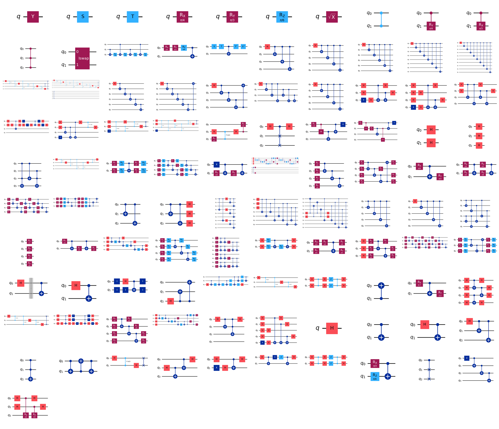
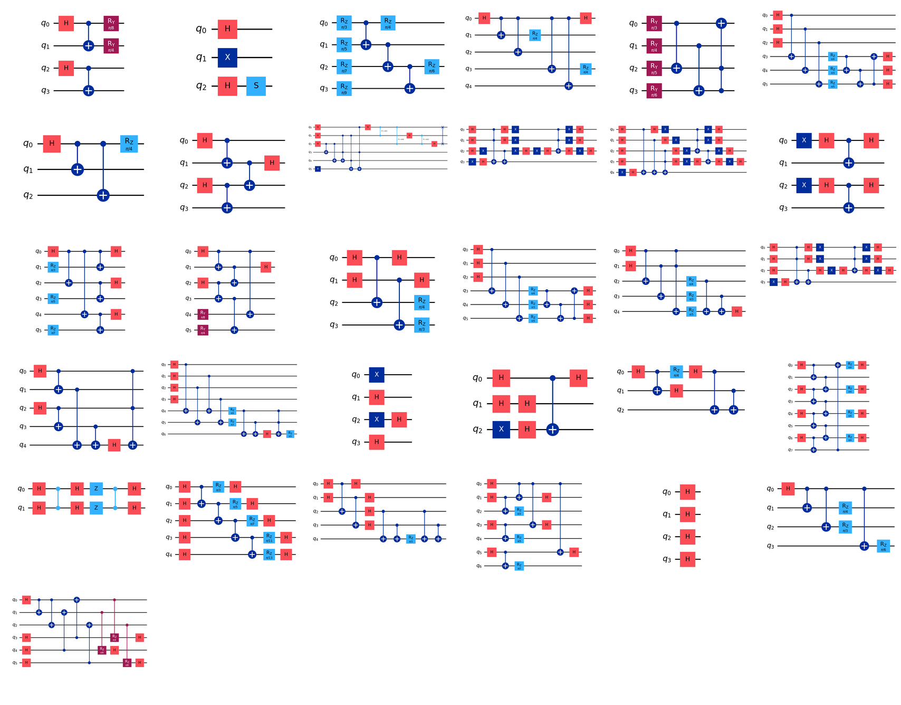

<!-- prettier-ignore-start -->
# QCV — Quantum Circuit Vision ⚛️  [](https://doi.org/10.5281/zenodo.20593035)

[](LICENSE)
[](https://www.python.org/)
[](https://huggingface.co/datasets/QuantBlockchain/qcv-dataset)
[](https://github.com/QuantBlockchain/quantum-circuit-vision)

[](https://aws.amazon.com/braket/)
[](https://aws.amazon.com/braket/)
[](https://qiskit.org)

[](https://www.anthropic.com)
[](https://www.anthropic.com)
[](https://www.anthropic.com)

<blockquote>
<p>Quantum Circuit Vision (QCV) studies whether multimodal LLMs can generate executable quantum code from circuit-diagram images. The project provides a difficulty-graded benchmark of <strong>132 circuits</strong> across 13 categories, reference implementations (Braket &amp; Qiskit), bilingual annotations, and verification tooling.</p>
</blockquote>

<!-- Badge-style navigation bar -->
[](README.md) 
[](docs/huggingface/DATASET_CARD.md) 
[](#quick-start) 
[](#repository-structure) 
[](scripts/) 
[](https://huggingface.co/datasets/QuantBlockchain/qcv-dataset) 
[](LICENSE)

## Key Findings

- **Claude Opus 4.6** achieves a **97.0% weighted score** under BV (20/21 pass on main benchmark)
- **CoT Sensitivity Window**: Chain-of-thought (TV) only helps near a model's capability boundary — it improves weaker models on simpler tasks but *degrades* performance on advanced circuits (−17pp)
- **Structural regularity > qubit count**: An 8-qubit regular circuit passes while 5-qubit and 7-qubit irregular circuits fail
- All generated code is verified end-to-end using **unitary matrix fidelity** on Amazon Braket's LocalSimulator

## Benchmark Overview

### 132 Circuits · 13 Categories · 1–10 Qubits

**General Quantum Circuits (101)**



**Blockchain Quantum Circuits (31)**



| Category | ID | Count | Qubits | Status | Examples |
|:---|:---:|:---:|:---:|:---:|:---|
| Basic | demo | 5 | 1–3 | ✅ Tested | Hadamard, CNOT, Bell, GHZ, Toffoli |
| Intermediate | inter | 10 | 2–4 | ✅ Tested | QFT, Grover, Teleportation, Deutsch, Phase Est. |
| Advanced | adv | 6 | 3–5 | ✅ Tested | 3-Qubit QFT, QAOA, VQE Ansatz, Bernstein-Vazirani |
| Blockchain | blockchain | 11 | 2–8 | 🔶 Partial | QRNG, BB84 QKD, Grover Mining, Consensus Protocol |
| Gate Coverage | A | 15 | 1–3 | ⬜ Pending | Y, S, T, Rx, Ry, Rz, √X, CZ, CRy, CRx, CCZ, iSWAP |
| Qubit Scaling | B | 12 | 4–10 | ⬜ Pending | GHZ 4–10q, QFT 4–5q, Ring/Star/Full Entanglement |
| Classical Algorithms | C | 15 | 2–4 | ⬜ Pending | Deutsch-Jozsa, Simon, Grover-4, Shor, QPE, HHL |
| Variational | D | 10 | 2–4 | ⬜ Pending | Hardware-efficient, UCCSD, QAOA-2layer, Data Reuploading |
| Error Correction | E | 8 | 3–9 | ⬜ Pending | Bit/Phase Flip, Shor-9, Steane-7, Surface Code |
| Quantum ML | F | 10 | 2–8 | ⬜ Pending | QNN, QCNN-8q, Quantum Kernel, QGAN, Classifier |
| Blockchain Extended | G | 8 | 3–6 | ⬜ Pending | E91 QKD, Quantum Money, Blind QC, Voting, Auction |
| Visual Variants | H | 10 | 2–4 | ⬜ Pending | Barrier, Compressed, Reversed Labels, Decomposed |
| **BTC/Blockchain Security** | **I** | **12** | **4–7** | ⬜ Pending | **Shor vs ECDSA, Grover vs SHA-256/AES, Kyber, Dilithium, SPHINCS+** |

> ✅ = 3 models × 2 modes tested · 🔶 = Opus BV only · ⬜ = Circuit + ground truth ready, experiments pending

### BTC/Blockchain Quantum Security (Direction I) — Detail

Circuits directly relevant to Bitcoin and blockchain quantum security:

| ID | Circuit | Qubits | Theme | Description |
|:---|:---|:---:|:---|:---|
| I01 | Shor vs ECDSA | 6 | 🔴 Attack | Period finding targeting elliptic curve (secp256k1 threat) |
| I02 | Grover vs SHA-256 | 4 | 🔴 Attack | Preimage search on hash function (mining/address threat) |
| I03 | Grover vs AES | 5 | 🔴 Attack | Key search on symmetric encryption (AES-128 → AES-64 effective) |
| I10 | PoW Quantum Speedup | 4 | 🔴 Attack | Quadratic speedup on proof-of-work nonce search |
| I04 | Lamport Signature | 4 | 🟢 Defense | One-time quantum-safe signature verification |
| I08 | Kyber (CRYSTALS) | 6 | 🟢 Defense | Lattice-based key encapsulation (NIST PQC standard) |
| I09 | Dilithium | 5 | 🟢 Defense | Lattice-based digital signature (NIST PQC standard) |
| I12 | SPHINCS+ | 7 | 🟢 Defense | Hash-based signature scheme (NIST PQC standard) |
| I05 | Quantum Random Beacon | 6 | 🔵 Infra | Multi-party randomness for consensus |
| I06 | QKD Network | 6 | 🔵 Infra | 3-node key distribution with entanglement swapping |
| I07 | Quantum Timestamp | 4 | 🔵 Infra | Unforgeable time proof for blockchain |
| I11 | Quantum Merkle Tree | 5 | 🔵 Infra | On-chain verification with quantum leaf hashing |

> 🔴 Attack surface · 🟢 Post-quantum defense · 🔵 Quantum-enhanced infrastructure

### Blockchain Coverage Summary

Total blockchain-related circuits: **31 / 132 (23.5%)**

| Group | Count | Focus |
|:---|:---:|:---|
| blockchain (original) | 11 | General quantum protocols for blockchain |
| G (extended) | 8 | Cryptographic protocols (QKD, voting, auction) |
| I (BTC security) | 12 | BTC-specific attack/defense/infrastructure |

## Results (Evaluated Subset: 21 Main + 11 Blockchain)

### Main Benchmark (21 circuits × 3 models × 2 modes)

| Model | Mode | Basic (5) | Intermediate (10) | Advanced (6) | Weighted Score |
|:---|:---:|:---:|:---:|:---:|:---:|
| Claude Opus 4.6 | BV | 100% | 90% | 100% | **97.0%** |
| Claude Opus 4.6 | TV | 100% | 100% | 83% | 91.5% |
| Claude Sonnet 4.6 | BV | 100% | 90% | 83% | 88.5% |
| Claude Sonnet 4.6 | TV | 100% | 90% | 83% | 88.5% |
| Claude Haiku 4.5 | BV | 60% | 60% | 33% | 46.5% |
| Claude Haiku 4.5 | TV | 80% | 70% | 16% | 45.0% |

Weighted score = 0.2 × Basic + 0.3 × Intermediate + 0.5 × Advanced

### Blockchain Extension (11 circuits, Opus BV)

Pass rate: **9/11 (81.8%)** — including an 8-qubit consensus protocol (256×256 unitary verified)

---

## Dataset on Hugging Face Hub

The full QCV-Dataset (132 circuits, 792 experiment results, bilingual annotations) is published on **Hugging Face Hub**:

**[https://huggingface.co/datasets/QuantBlockchain/qcv-dataset](https://huggingface.co/datasets/QuantBlockchain/qcv-dataset)**

```python
from datasets import load_dataset

# Load all 132 circuits with images, code, and annotations
circuits = load_dataset("QuantBlockchain/qcv-dataset", "circuits", split="train")

# Load all 792 experiment results
experiments = load_dataset("QuantBlockchain/qcv-dataset", "experiments", split="train")

# Access a sample
sample = circuits[0]
print(sample["id"])              # A01_single_y
print(sample["circuit_image"])    # PIL.Image — circuit diagram
print(sample["braket_code"])      # Executable Braket code
print(sample["description_en"])   # English description
print(sample["description_cn"])   # Chinese description
```

### Data Governance Standards

Publishing on Hugging Face Hub with structured metadata ensures our dataset is **discoverable, interoperable, and reusable** across the ML ecosystem. We adhere to three complementary layers of data governance:

| Layer | Standard | Purpose |
|:---|:---|:---|
| **Dataset Card (YAML)** | Hugging Face Hub metadata | Search/discovery, task categorization, license clarity |
| **Croissant JSON-LD** | [MLCommons Croissant](https://github.com/mlcommons/croissant) [^1] | Machine-readable schema for cross-platform tool integration |
| **Croissant-RAI** | [MLCommons RAI Extension](https://docs.mlcommons.org/croissant/docs/croissant-rai-spec.html) [^1] | Responsible AI documentation: provenance, limitations, biases |

**Why this matters.** Croissant [^1] is an emerging industry standard (Google Dataset Search, Kaggle, OpenML) that represents datasets as structured metadata graphs. Combined with the RAI extension, it documents data collection methods, known limitations, and ethical considerations — making our quantum circuit dataset reproducible and trustworthy for downstream research.

### How We Did It

1. **Consolidated 5 modalities** (circuit images, Braket code, Qiskit code, state vectors, bilingual annotations) into structured Parquet configs using the `datasets` library with explicit `Features` schema
2. **Used `Image()` feature type** to embed circuit diagrams as bytes — enabling the Hugging Face Dataset Viewer to render circuit previews directly in the browser
3. **Wrote a Croissant-RAI overlay** documenting data provenance (Qiskit generation + expert curation), verification protocol (fidelity ≥ 0.99 on Braket LocalSimulator), known biases (23.5% blockchain-relevant circuits), and use cases
4. **Structured the dataset card** with YAML front matter for automatic task categorization and discoverability on Hugging Face Hub

### Related Files

| File | Description |
|:---|:---|
| [`docs/huggingface/DATASET_CARD.md`](docs/huggingface/DATASET_CARD.md) | Hugging Face dataset card with YAML metadata |
| [`scripts/hf/upload_to_huggingface.py`](scripts/hf/upload_to_huggingface.py) | Upload script (datasets → HF Hub with Croissant-RAI) |
| [`docs/huggingface/GUIDE.md`](docs/huggingface/GUIDE.md) | Step-by-step guide for re-uploading or updating the dataset |

[^1]: Akhtar, M., Benjelloun, O., Conforti, C., Foschini, L., Gijsbers, P., Giner-Miguelez, J., Goswami, S., Jain, N., Karamousadakis, M., Krishna, S., Kuchnik, M., Lesage, S., Lhoest, Q., Marcenac, P., Maskey, M., Mattson, P., Oala, L., Oderinwale, H., Ruyssen, P., Santos, T., Shinde, R., Simperl, E., Suresh, A., Thomas, G., Tykhonov, S., Vanschoren, J., Varma, S., van der Velde, J., Vogler, S., Wu, C.-J., & Zhang, L. (2024). *Croissant: A Metadata Format for ML-Ready Datasets*. Advances in Neural Information Processing Systems, 37, 82133–82148. https://doi.org/10.52202/079017-2610

## Repository Structure

```
quantum-circuit-vision/
├── dataset/                         # 132 circuits, 5 core modalities
│   ├── circuits/                    # Circuit diagram images (PNG)
│   ├── braket_code/                 # Amazon Braket SDK ground truth (.py)
│   ├── qiskit_code/                 # Qiskit implementations (.py)
│   ├── simulations/                 # State vectors (JSON)
│   ├── annotations/                 # Bilingual EN/CN annotations + experiment results (JSON)
│   ├── failures/                    # Annotated failure cases (JSON)
│   ├── equivalences/                # Circuit equivalence pairs (JSON)
│   ├── experiment_results/          # 792 raw model outputs + verification CSV
│   └── targets/                     # Natural language target descriptions (JSON)
├── docs/
│   └── huggingface/                 # Hugging Face Hub documentation
│       ├── DATASET_CARD.md          # HF dataset card (YAML + Markdown)
│       └── GUIDE.md                 # Upload guide
├── scripts/
│   ├── hf/                          # Hugging Face upload tooling
│   │   └── upload_to_huggingface.py # Upload script with Croissant-RAI
│   ├── load_dataset.py              # Local dataset loader
│   ├── generate_circuits.py         # Circuit generation
│   ├── generate_intermediate.py     # Intermediate circuit generation
│   ├── generate_advanced.py         # Advanced circuit generation
│   └── verify.py                    # Verification pipeline
├── prompts/                         # BV and TV prompt templates
├── results/                         # Aggregated experiment results
├── assets/                          # README figures
├── requirements.txt
├── CITATION.cff                     # Machine-readable citation metadata
├── DATASHEET.md                     # Dataset documentation (Gebru et al., 2021)
├── CIRCUIT_CATALOG.md               # Full listing of all 132 circuits
├── LICENSE
└── README.md
```

## Quick Start

### Install dependencies

```bash
pip install -r requirements.txt
```

### Generate circuit diagrams

```bash
python scripts/generate_circuits.py        # Basic (5 circuits)
python scripts/generate_intermediate.py    # Intermediate (10 circuits)
python scripts/generate_advanced.py        # Advanced (6 circuits)
```

### Verify a generated code file

```bash
python scripts/verify.py demo_03_bell path/to/generated_code.py
```

## Prompting Modes

**Basic Vision (BV):** Provide the circuit image with a direct code generation instruction.

**Thinking Vision (TV):** Ask the model to first analyze the circuit structure (qubit count, gate sequence, control relationships), then generate code based on its analysis.

See `prompts/prompts.txt` for the exact templates.

## Verification Pipeline

1. **Syntax check** — Python `compile()`
2. **Execution check** — Run in sandboxed namespace, verify a valid Braket `Circuit` object is produced
3. **Unitary fidelity** — Compute full unitary matrices for generated and ground truth circuits on LocalSimulator; pass if fidelity ≥ 0.99

## Citation

```bibtex
@inproceedings{liu2026qcv,
  title={QCV: Quantum Circuit Code Generation using Visual Capabilities of Multi-Modal Large Language Models},
  author={Liu, Dongping and Zhang, Aoyu and Zhang, Luyao},
  year={2026}
}
```

If you use the Hugging Face dataset or Croissant metadata, please also cite:

```bibtex
@inproceedings{NEURIPS2024_9547b09b,
  author = {Akhtar, Mubashara and Benjelloun, Omar and Conforti, Costanza and Foschini, Luca and Gijsbers, Pieter and Giner-Miguelez, Joan and Goswami, Sujata and Jain, Nitisha and Karamousadakis, Michalis and Krishna, Satyapriya and Kuchnik, Michael and Lesage, Sylvain and Lhoest, Quentin and Marcenac, Pierre and Maskey, Manil and Mattson, Peter and Oala, Luis and Oderinwale, Hamidah and Ruyssen, Pierre and Santos, Tim and Shinde, Rajat and Simperl, Elena and Suresh, Arjun and Thomas, Goeffry and Tykhonov, Slava and Vanschoren, Joaquin and Varma, Susheel and van der Velde, Jos and Vogler, Steffen and Wu, Carole-Jean and Zhang, Luyao},
  booktitle = {Advances in Neural Information Processing Systems},
  doi = {10.52202/079017-2610},
  editor = {A. Globerson and L. Mackey and D. Belgrave and A. Fan and U. Paquet and J. Tomczak and C. Zhang},
  pages = {82133--82148},
  publisher = {Curran Associates, Inc.},
  title = {Croissant: A Metadata Format for ML-Ready Datasets},
  url = {https://proceedings.neurips.cc/paper_files/paper/2024/file/9547b09b722f2948ff3ddb5d86002bc0-Paper-Datasets_and_Benchmarks_Track.pdf},
  volume = {37},
  year = {2024}
}
```

## License

This project is licensed under the MIT License — see [LICENSE](LICENSE) for details.
