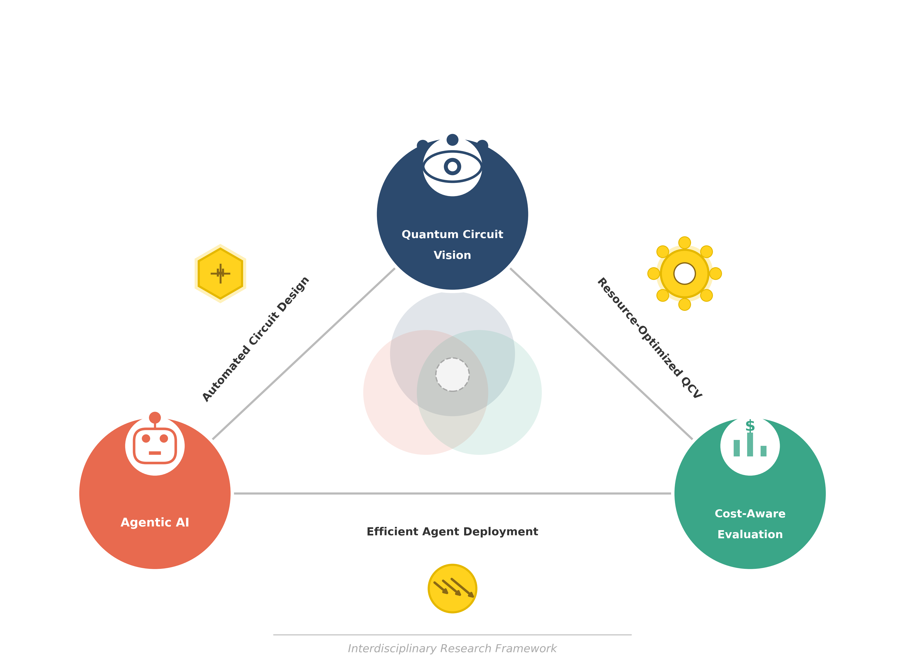

# Interdisciplinary Framework Figure

This folder contains the figure and the Python source files used to reproduce it:

- `qcv_interdisciplinary_framework.py`: Python script version.
- `QCV_Interdisciplinary_Framework.ipynb`: Jupyter notebook version.

Both files provide Python code to replicate the same figure shown above.
